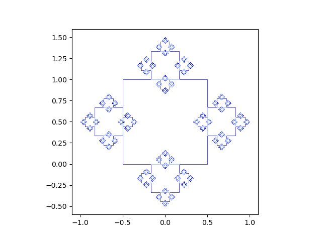

# Dynamic systems course 2022: Fractals
## Definition
Exercise for the generation of a fractal where in each iteration a square is added located in the middle of each side, and one third of the size.

### Writed by: Gustavo Alfredo Zárate Acosta (GustavoZA20@hotmail.com)
Information Technology in Sciences student at ENES Morelia, UNAM.

## Introduction
It seeks to generate a geometric model where when approaching a particular part of the figure, it looks like a replica of a larger or smaller part of the figure, which contains a finite area limited by an infinite perimeter

## Methodology
We sought first to generate the four points of the first square, then we locate what will be the starting point of the next generation of squares to place them in the middle of the sides of the square, recursively repeating this process with the following generations of squares

## Requiriments
This proyect use Python v. 3.8,
### Libraries
1. Numpy
     - ```pip3 install numpy==1.61.2```
2. Matplotlib
     - ```pip3 install matplotlib==3.0.2```

## Run
  Create an image called 'fractal.png' and display it in an interactive window
  ```bash
   $ python ex1.py
  ```
### Results


## References 
[Matplotlib](https://matplotlib.org/2.1.2/) Documentation.
[Dynamic System 2022 course](https://github.com/giccunam/dynamicsystems2022).
